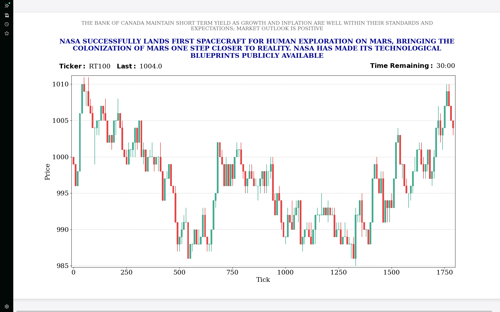

# Live RIT Index Chart Visualizer

This is a Python Flask application designed to visualize Social Outcry Case real-time market data from the Rotman Interactive Trader (RIT) simulation DMA REST API. It generates a dynamic, auto-refreshing candlestick chart representing the market index, complete with live news headlines and simulation status.

## 📸 Example Output

<p align="center">
  
</p>

## 🚀 Features

* **Real-Time Candlestick Charting:** Aggregates live data into candlesticks (OHLC) with custom up/down coloring.
* **Live News Feed:** Displays the most recent and previous news headlines directly on the chart header.
* **Market Status:** Shows the current index price and remaining simulation time.
* **Auto-Refreshing Web Interface:** The frontend automatically refreshes the chart without requiring a page reload.
* **Matplotlib Integration:** Uses the `Agg` backend for high-performance server-side image rendering.

## 📂 Project Structure

The Flask app lives under `charting_flask/`. Two versions are shipped:

* `app_v1.py` — original live-polling version. Builds candles from the
  current `/securities` price polled in real time. Best when you start the
  app **before** the simulation starts.
* `app_v2.py` — improved version. Reads `/securities/history`, so it
  reconstructs the full chart even if you connect mid-case, exposes a
  `/tickers` endpoint, and lets the frontend pick the ticker and candle
  size via query parameters.

```text
RIT-Software-Charting-Feature/
│
├── README.md
├── Charting_example.png       # Example output shown above
├── RIT_Price_Plotting.py      # Standalone Matplotlib (non-Flask) version
├── RIT_Price_Plotting_v2.py   # Standalone version using mplfinance
└── charting_flask/
    ├── app_v1.py              # Flask app (live polling)
    ├── app_v2.py              # Flask app (history-based, recommended)
    ├── requirements.txt
    └── templates/
        └── index.html         # Frontend (must live in `templates/`)
```

## 🛠 Prerequisites

* Python 3.7+
* Access to the Rotman RIT Server API (ensure the simulation is running or the API endpoint is accessible).

## 📦 Installation

1. **Clone or Download** this repository.

2. **Install Dependencies:**
   It is recommended to use a virtual environment.

   ```bash
   pip install -r charting_flask/requirements.txt
   ```

## ⚙️ Configuration

By default the app talks to `http://flserver.rotman.utoronto.ca:10001/v1`
with the demo credentials (`1` / `1`). Override anything via environment
variables — no source edits needed:

| Variable        | Default                              | Purpose                          |
| --------------- | ------------------------------------ | -------------------------------- |
| `RIT_HOST`      | `flserver.rotman.utoronto.ca`        | API hostname                     |
| `RIT_PORT`      | `10001`                              | API port (DMA REST)              |
| `RIT_API_URL`   | `http://$RIT_HOST:$RIT_PORT/v1`      | Full override of the base URL    |
| `RIT_USERNAME`  | `1`                                  | Basic-auth user                  |
| `RIT_PASSWORD`  | `1`                                  | Basic-auth password              |
| `RIT_TICK_LIMIT`| `1800`                               | Tick at which the chart freezes  |

Example:

```bash
export RIT_HOST=localhost
export RIT_PORT=10001
python charting_flask/app_v2.py
```

## 🏃 Usage

1. **Start the Application:**

   ```bash
   python charting_flask/app_v2.py
   ```

2. **Access the Chart:**
   Open `http://127.0.0.1:5000/` in a browser. Use the toolbar at the top
   to pick a ticker and the number of ticks per candle.

3. **Start the Simulation:**
   Once the RIT case is `ACTIVE` / `RUNNING`, the chart will begin updating.

## 🔧 Troubleshooting

* **`TemplateNotFound: index.html` Error:**
  Make sure `index.html` is inside `charting_flask/templates/` and that you
  run `python charting_flask/app_v2.py` (Flask looks for `templates/` next
  to the app file).

* **Empty Chart / No Data:**
  Ensure `RIT_HOST` / `RIT_PORT` (or `RIT_API_URL`) point to a reachable
  Rotman server, and that `RIT_USERNAME` / `RIT_PASSWORD` match the
  credentials configured in RIT.

* **News Text Cut Off:**
  If news headlines are too long, the script automatically wraps them. You can adjust the wrapping width / max lines in the `wrap_headline` function or increase the figure size in `make_figure`.

## 📜 License

This project is licensed under the **MIT License**. See the `LICENSE` file for details, and for educational purposes related to the Rotman Interactive Trader simulations.

---

## 📜 Acknowledgements

Developed as part of the **Rotman International Trading Competition (RITC)** and **Rotman Finance Group Finance Research & Trading Lab** educational ecosystem.

**Copyright © Rotman BMO Finance Group Finance Research & Trading Lab, University of Toronto.**
All rights reserved.

---

## 🧩 Author

**Yi-Ming Chang**
Educational Developer, Rotman Finance Research & Trading Lab
University of Toronto
